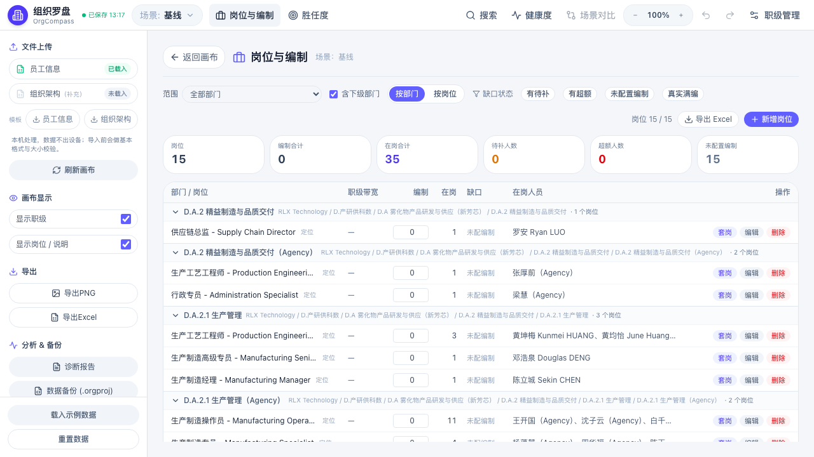

<div align="center">


# 组织罗盘 · OrgCompass

**从画组织架构，到看懂组织问题。**<br>一款面向 HRBP / 组织发展（OD）的本地优先组织设计与健康诊断工作台。

[](https://github.com/MaxHou-infinity/orgcompass/releases/latest) [](LICENSE)  

**[下载最新版](https://github.com/MaxHou-infinity/orgcompass/releases/latest)** · **[查看功能](#核心能力)** · **[了解诊断口径](#诊断如何工作)** · **[反馈问题](https://github.com/MaxHou-infinity/orgcompass/issues/new/choose)**

</div>

---

## 30 秒了解 OrgCompass

很多组织架构工具停在“把框画出来”。OrgCompass 继续往前一步：把组织数据变成可检查、可推演、可交付的决策材料。


| 你正在解决的问题 | OrgCompass 给出的结果 |
| --- | --- |
| 组织调整前，方案只存在于脑中 | 保存基线、方案 A、方案 B，分别推演组织结构 |
| 管理层级、管理幅度靠人工逐个数 | 自动计算并用红 / 黄 / 绿状态提示异常 |
| 编制、实际人数和招聘缺口分散在表格里 | 按部门汇总编制、实际、空岗 / 超编和职级成本 |
| 组织图画完后仍要手工整理汇报材料 | 导出组织图、Excel 和包含建议的诊断报告 |

> OrgCompass 的目标不是替 HRBP 做判断，而是把判断所需的结构、指标和差异摆到同一张工作台上。

---

## 真实产品界面

三个大功能都是**页面级子界面**：点进去占满画布区，左上角「返回画布」，同一时刻只打开一个，彼此之间可直接切换。

**岗位与编制** —— 组织内所有岗位、编制与缺口、增删改与套岗都在这一页：



**组织健康度** —— 指标、判读与优化建议同屏；人岗核对问题也收在这一页：


以上均为真实运行界面（同一份示例数据）。

---

## 核心能力

### 1. 设计组织，而不只是画组织图

- L1–L6 多级部门树与清晰的父子引导线
- 新建 / 删除部门，拖拽部门调整层级，拖拽或框选批量移动员工
- **层级归属有规则**：新建部门只能归属层级更浅的部门，选同级或下级会被拒绝并说明原因；也可以先不指定归属，之后在画布上拖动
- **删除部门有前置条件**：卡内还有成员时不允许删除，会列出具体是谁并要求先挪走；还有子部门时同理（保护子树不被静默丢弃）
- 部门负责人、岗位、职级、编制和成本信息同图呈现
- 搜索定位、撤销 / 重做、触控板缩放与画布平移
- 兼岗人员、未入架构员工和负责人选择

### 2. 看见组织健康度

- 管理幅度、层级深度、管理者比、空岗率四项核心指标
- 红 / 黄 / 绿状态判读与整体诊断
- 编制 vs 实际 vs 缺口，联动职级成本
- 根据指标和部门异常生成规则化建议
- 阈值可按企业阶段和管理口径调整，并保存在本地

### 3. 推演方案，而不是覆盖原方案

- 基线、方案 A、方案 B 等多个场景快照
- 自动保存与撤销 / 重做
- `.orgproj` 项目文件保存、打开和换机备份
- 在同一份组织数据上尝试不同汇报线和人员安排

### 4. 从数据输入到报告输出

- 导入员工 Excel 即可生成组织架构图；组织架构 Excel 作为**可选补充层**，只补两件员工表装不下的事：无人的空部门、部门负责人
- 胜任度评分 Excel 导入
- 互联网科技、制造业、零售连锁、医院科层、教育服务模板
- 导出 PNG、Excel、管理层报告与组织诊断报告
- Web 与 Tauri 桌面端共用同一套数据模型

### 5. 胜任度评估与人工复核

- 干部（领导力）与员工（业务能力 / 单兵能力）两套维度，红黄绿灯贯穿到员工层
- 批量评估网格、Excel 评分导入、HRBP 校准分并列对照
- 评价完整度与能力灯号分开表达：**部分已评即使已评维度全绿，也不算完整达标**
- 同日修订留痕、评分冲突待核对、人工确认与撤销各自留痕且不自动下结论
- 调岗后旧岗位评分只作历史可见并标注「适用性待复核」

### 6. 岗位与编制（一个页面管完岗位的增删改与缺口）

从顶部「**岗位与编制**」进入，把原来分散在「岗位操作弹窗」与「缺口清单弹窗」的两件事合成一个页面：

- **看到组织内所有岗位**，含还没有人的空岗位；汇总条给出岗位数 / 编制合计 / 在岗合计 / 待补 / 超额 / 未配置编制
- **新增 / 编辑 / 删除岗位**：新增时选目标部门与名称、序列、职级带宽、编制；编辑用行内表单；删除前会先说明会影响哪些人
- **编制就地可改**，改完立即重算缺岗还是超编，不用回到画布上找那个输入框
- **套岗**：候选人列表显示每人「现属 部门 › 岗位」，按本部门 / 跨部门排列；确认后行内的在岗名单立即变化。套岗是**调动**语义（换岗同时换部门）
- **按部门 / 按岗位双视图**：同一个岗位名可能出现在多个部门（真实数据里 15 个岗位实体只有 13 个不同名称），按岗位视图会把同名岗位合并成一行并标注「分布在 N 个部门」，展开可看各部门的独立编制与在岗
- **删除岗位后会持续提示**：清楚列出「当前有 N 名员工处于无明确岗位状态」，区分「未套岗」与「岗位已删除」，并给出处置建议
- 待补与超额**分别求和**，不用一个岗位的超编抵消另一个岗位的待补；未配置编制（编制 0）与真实满编分别表达
- 找不到成本依据时显示「无法估算」，不写成 0；部分缺失时总额标为「已知部分」
- 界面与 Excel 消费同一份筛选结果；默认不含个人姓名、工号、薪酬与评分

---

## 操作入口速查

顶部菜单只放高频操作；左侧栏负责画布的导入、导出、备份与显示。三个大功能是**页面级子界面**：
点进去后左上角都有「返回画布」，同一时刻只打开一个，彼此之间可直接切换。

| 想做什么 | 入口 | 形式 |
| --- | --- | --- |
| 导入员工 / 组织架构 Excel | 左侧栏 **文件上传** | 行内上传（点整行即可选文件） |
| 下载 Excel 模板 | 左侧栏 **文件上传** 下方的「模板」一行 | 员工信息模板 / 组织架构模板 |
| 载入示例数据（5 个行业模板） | 左侧栏底部 **载入示例数据** | 选择器，带组织结构预览 |
| 岗位增删改 / 编制 / 套岗 / 缺口 / 导出 | 顶部 **岗位与编制** | 页面级子界面 |
| 组织健康度（含人岗核对） | 顶部 **健康度** | 页面级子界面 |
| 胜任度评估与看板 | 顶部 **胜任度** | 页面级子界面 |
| 诊断报告 | 左侧栏 **分析 & 备份 → 诊断报告** | 可打印 / 导出的报告 |
| 备份与恢复 `.orgproj` | 左侧栏 **分析 & 备份** | 数据备份 / 从 .orgproj 恢复（并排） |
| 职级配置（颜色 / 标签 / 成本） | 顶部 **职级管理** | 弹窗 |
| 场景切换 / 新建 / 复制 / 对比 | 顶部品牌右侧 **场景切换器** | 下拉 + 场景差异比较 |
| 搜索、缩放、撤销 / 重做 | 顶部右侧 | 快捷键与按钮 |
| 新建 / 删除部门、调整层级归属 | 左侧栏 **创建部门**；部门卡表头右键 | 表单 / 右键菜单 |

> 组织架构 Excel 是**可选补充层**：只补「无人的空部门」与「部门负责人」两件事，
> 画布的主结构来自员工信息表。两份都可以不传满 —— 只传员工表也能出完整架构图。

---

## 适合哪些工作场景

| 场景 | 典型问题 | 推荐用法 |
| --- | --- | --- |
| 组织调整 | 新旧方案差异难以讲清 | 保存基线并建立多个场景，分别调整部门与汇报线；用**场景对比**看差异 |
| 年度编制规划 | 编制、缺口、成本来回对表 | 在**岗位与编制**页面补齐各部门岗位编制与职级成本，缺口随改随算 |
| 组织健康体检 | 不知道哪里层级过深、管理幅度异常 | 打开**健康度**页面，按红黄绿状态定位部门和指标；人岗核对问题也在这一页 |
| 招聘协同 | 招聘需求缺少组织上下文 | 用部门缺口和成本信息形成更清晰的需求依据 |
| 管理层汇报 | 组织图与诊断结论分散 | 导出组织图、明细表和诊断报告作为讨论底稿 |

---

## 诊断如何工作

OrgCompass 当前使用透明、可配置的规则口径，不使用不可解释的“黑盒评分”。

| 指标 | 当前计算口径 | 默认健康区间 |
| --- | --- | --- |
| 管理幅度 | 有负责人部门「直管人数」的中位数（直管 = 直属员工 **不含负责人本人** + 下一层有负责人子部门数）；单点极宽会单独标出 | 3–8 人 |
| 层级深度 | 部门节点深度分布的 P90（根 L1=1），同时展示最大层数与最深链路；孤立深链触发关注、超硬上限触发预警 | 不超过 4 层 |
| 管理者比 | 内部负责人数（按真人同一键去重、剔除不在员工名册内的外部负责人与副职/代理/挂名负责人，只计正职）÷ 员工总数（同样按真人同一键去重；含管理者，不含虚拟兼岗） | 不超过 15% |
| 空岗率 | （有效编制数 − 实际人数）÷ 有效编制数；只统计已配置有效编制的部门，未配置的部门不进分子也不进分母。实际人数与编制按同一范围、按真人内部 ID 去重。**实际人数超出编制时为空岗率负值，此时按超编梯度判读，不会因为负值被判成健康** | 不超过 10% |

> 「编制未配置」与「编制冻结」在口径上分开：前者提示补充编制，后者说明本期不计缺口（不把冻结说成未录入）。
> **当前版本暂不提供「冻结 / 解冻编制」的操作入口**，因此界面上的「编制冻结」筛选项已隐藏 —— 数据层与口径都保留，
> 将来补上操作入口即可恢复。

- 阈值可以在**健康度页面**中调整，默认值只是通用起点。
- 未设置负责人、编制或员工数据时，系统会说明无法计算的原因，不把缺失数据伪装成健康结论。
- 优化建议由异常指标与部门数据触发，数量随当前组织情况变化。

### 胜任度与缺口清单口径

| 项目 | 当前计算口径 |
| --- | --- |
| 评价完整度 | 应评维度 = 当前分类（干部 / 员工）下启用的模型维度；完整度 = 有效已评维度 ÷ 应评维度。**部分已评即使已评维度全绿也不算完整达标** |
| 能力灯号 | 最差维度 Gap（木桶）：≤0 绿 / =1 黄 / ≥2 红；权重只影响总分，不影响灯号 |
| 岗位适用性 | 优先使用绑定当前任职的岗位评价；旧记录仅在能唯一对上当前任职时可用，否则标为「历史岗位评价，适用性待复核」，不自动成为新岗位结论 |
| 同日修订 | 同一人 / 范围 / 维度 / 角色 / 评估时点内按修订链取终点；旧分保留；内容冲突且无修订关系时标记「评分冲突待核对」，不按顺序任选 |
| HRBP 校准 | 与上级原始分并列呈现，不参与原始灯号与完整度分子 |
| 待补 / 超额 | 待补 = max(编制 − 主岗占用, 0)，超额 = max(主岗占用 − 编制, 0)；两者分别求和，净额只作补充 |
| 缺口成本 | 单位万元/月；依据顺序：岗位职级带宽 → 在岗目标职级成本均值 → 在岗实际成本均值；找不到依据时留空并标「无法估算」，不写成 0 |

> **使用边界：** 指标用于发现值得讨论的结构性信号，不替代业务背景、人才判断、劳动关系和管理责任。
> 胜任度与复核只呈现可追溯依据，不自动定级、晋升或淘汰；岗位缺口清单是编制缺口事实，不是已批准招聘需求。

---

## 下载与运行

### 普通用户：下载桌面版

前往 **[Latest Release](https://github.com/MaxHou-infinity/orgcompass/releases/latest)**，根据系统选择安装包：

| 系统 | 支持范围 | 推荐文件 |
| --- | --- | --- |
| macOS | Apple Silicon（arm64） | `OrgCompass_*_aarch64.dmg` |
| Windows | 64 位（x64） | `OrgCompass_*_x64-setup.exe` |
| Windows 管理部署 | 64 位（x64） | `OrgCompass_*_x64_en-US.msi` |

当前版本不提供 Intel Mac 与 Linux 安装包。v2.0.5 及以前的历史 Release 可能仍包含旧平台资产。

> **macOS 签名状态：当前发布的 macOS 安装包为 adhoc 签名，未做 Apple 公证。**
> 首次打开时系统可能提示「无法验证开发者」，请在「访达」中右键点击应用选择「打开」，或前往
> 「系统设置 → 隐私与安全性」允许打开。Windows 安装包同样未做代码签名，可能出现 SmartScreen 提示。
> 这是当前版本的已知限制，不影响应用功能与本地数据。

### 开发者：运行 Web 版

Web 版目前提供源码运行与自行部署，不代表已有公开在线服务。

> 前置要求：**Node `^20.19.0` 或 `>=22.12.0`**（Vite 8 的最低要求）。
>
> 注意：**运行测试需要 Node `>=22`** —— 测试环境 jsdom 30 依赖的 undici 在 Node 20.19 上无法加载。
> Node 20.19 可以正常开发（`npm run dev`）、构建（`npm run build`）与打包桌面端，只是不能跑单测。

```bash
git clone https://github.com/MaxHou-infinity/orgcompass.git
cd orgcompass
npm ci
npm run dev
```

构建静态 Web 产物：

```bash
npm run build
npm run preview
```

### 开发者：运行 Tauri 桌面版

macOS 需要 Xcode Command Line Tools 与 Rust；Windows 需要 WebView2 与 Rust。

```bash
npm run tauri:dev
npm run tauri:build
```

---

## 数据与隐私

OrgCompass 采用本地优先设计：

- 不需要账号或业务服务器即可运行
- 当前版本不包含云端同步、组织数据上传或遥测服务
- Web 版自动保存到浏览器本地存储
- 桌面版可通过 `.orgproj` 文件备份和迁移项目
- Excel、组织结构与诊断计算均在本机完成

组织和人员数据通常具有敏感性。请使用企业认可的设备与文件存储方式，并妥善管理导出的图片、Excel、报告和项目备份。

---

## Roadmap

路线图表达产品方向，不等同于具体版本或发布日期承诺。

### 已交付

- **v2.0.8** 信任与稳定性收口：`xlsx` 高危依赖处置、Tailwind 4 / Vite 8 迁移、发布与导入护栏
- **v2.0.9** 口径可信化：管理幅度改中位数 + 极值、层级深度 P50/P90、管理者比去重、场景差异比较
- **v2.1.1** 岗位化：岗位实体与岗位级编制、富字段导入、人岗匹配状态、招聘缺口视图
- **v2.2.0 / v2.2.1** 胜任度引擎：领导力与员工能力评估、红黄绿灯、批量评估、使用体验收敛
- **v2.3.0** 排兵布阵可用化：人岗事实一致、评估可信与复核闭环、看板整合、岗位缺口清单
- **v2.3.1** 事实与口径收口：修正超编判读 / 管理幅度 / 去重等口径失真，修复导入与迁移的数据安全问题
- **v2.3.2** 导入契约重定义与画布可读性：员工表成为画布主结构来源、组织架构表降级为可选补充层；岗位两列合并、层级断档可视化、重导入不再清零编制；卡片加宽至 320px、层间步进改用运行期实测卡高；`.orgproj` 恢复入口与备份并排、文件名带时间戳；职级配置提升为工作区级、颜色值加固
- **v2.4.0** 岗位与编制的完整闭环 + 子页面交互统一：新增**删除部门**（有成员时提示先挪人）与**新建部门不得归属同级/下级**两条规则；「岗位操作」与「缺口清单」合并为**页面级「岗位与编制」**（双视图、编制就地改、增删改岗位、套岗、删除后的无岗位提示）；「建虚拟兼岗」并入创建虚拟员工流程（必选目标部门与目标岗位）；**组织健康度、胜任度同样改为页面级子界面**，「人岗核对」从主页面横幅收进健康度；顶部菜单两行合并为一行（高度 104→48px）；入口归位（行业模板并入「载入示例数据」、工具模板移入文件上传、示例数据删除）

### Next · 排兵布阵决策

- 把组织健康度与排兵布阵健康度整合为同一张可下钻的看板
- 面向招聘 BP 的岗位缺口与成本闭环（已具备清单与成本估算基础）
- 权限、隐私、评价偏差与人工复核的治理机制

> 行业基准引擎需要跨企业样本标定，维持长期挂起；场景合并/归档、N 场景对比矩阵仍属候选。

欢迎通过 [Issues](https://github.com/MaxHou-infinity/orgcompass/issues/new/choose) 提交场景、问题和建议。

---

## 技术与质量

React 18 · TypeScript strict · Vite 8 · Tailwind CSS 4 · dnd-kit · Tauri 2 · Rust · xlsx · html2canvas · Vitest

```bash
npm run verify          # 一键门禁：版本一致性 → 类型（含测试）→ lint → 覆盖率门槛 → 构建
npm run lint
npm run test
npm run test:coverage   # 带覆盖率门槛（statements/branches/functions/lines）
npm run build
```

版本号在 `package.json` / `package-lock.json` / `src-tauri/tauri.conf.json` / `Cargo.toml` / `Cargo.lock`
五处必须一致，由 `npm run version:check` 机器校验（CI 与发布流程都会跑）。

质量规模：**807 项单元 / 组件测试** + **131 项真实 Chromium 交互测试** + **83 项视觉回归（几何断言）**。
交互与视觉测试用真实浏览器跑，因为 jsdom 不排版 —— 溢出、换行、对齐、等高这类缺陷它测不出来：

```bash
python3 tests/e2e/run.py              # 交互 + 视觉回归（需先 npm run dev 或 npm run tauri:dev）
python3 tests/e2e/run.py interaction
python3 tests/e2e/run.py visual
```

**产品版本与文件格式版本是两条独立演进线**：当前产品版本 2.4.0，`.orgproj` 文件格式版本为 **4**。
本版未改动文件格式，因此 2.4.0 可以无损读取旧版项目文件。

目录结构：

```text
├── src/                     # React 应用：components / utils / types（测试与源码同目录）
├── src-tauri/               # Tauri 桌面端（Rust）与打包配置
├── tests/
│   ├── e2e/                 # 真实 Chromium 交互测试 + 视觉回归（Playwright，Python）
│   └── fixtures/excel/      # Excel 端到端解析用的真实样本
├── scripts/                 # check-versions.mjs：五个版本源的机器校验
├── docs/
│   ├── assets/              # README 视觉资产
│   ├── design/              # v2.0.x 交互与视觉设计记录
│   ├── releases/            # 各版本发布说明
│   └── v2xx-*.md            # 迭代期内部归档（已 gitignore，仅本地）
├── public/                  # 静态资源
└── .github/workflows/       # CI 检查 + 多平台 Release 构建
```

> 根目录只保留工具链约定的标准文件（`package.json` / `vite.config.ts` / `tailwind.config.js` /
> `postcss.config.js` / `eslint.config.js` / 三份 `tsconfig` / `index.html` 与 `LICENSE`、`SECURITY.md`）。
> 其中三份 tsconfig 是**有意拆分**的：`tsconfig.json` 管应用源码、`tsconfig.node.json` 管 Node 上下文
> （如 `vite.config.ts`）、`tsconfig.test.json` 管测试环境 —— 三者 `lib` / `types` 不同，且 tsc、Vite、ESLint
> 都按约定从项目根查找配置，因此必须放在根目录。

---

## 许可证

[Apache License 2.0](LICENSE) © 2026 [Max Hou](https://github.com/MaxHou-infinity)

允许商用、修改和分发；请按许可证要求保留版权与许可证声明，并标注修改。

<details>
<summary>品牌与历史安装包兼容说明</summary>

项目已由 `OrgStructureDesigner` 升级为 **组织罗盘 OrgCompass**。v2.0.4 及以前的安装包仍使用旧文件名前缀；自 v2.0.5 起使用 `OrgCompass_*`。历史安装包名称不同不影响其对应版本功能。

</details>
